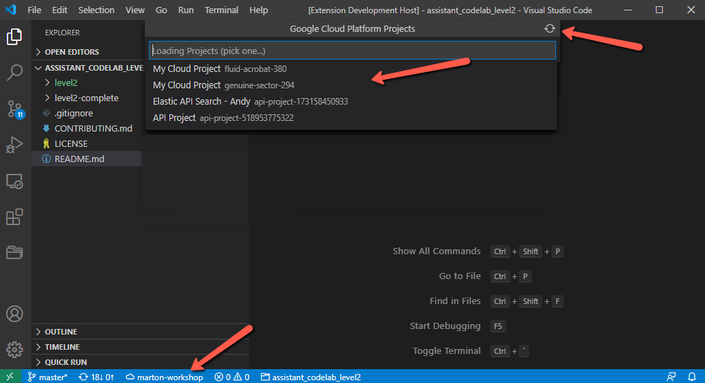

## Features

Google Cloud Platform Project Switcher helps displaying the current GCP project in VS Code's statusbar, and you can are able to quickly change between multiple projects. Work well when working or deploying with `gsutil` tool from terminal, or from pre-configured tasks. Like quickly deploy to Cloud Run. 

> Tip: Many popular extensions utilize animations. This is an excellent way to show off your extension! We recommend short, focused animations that are easy to follow.

## Requirements

`gsutil` tool must be installed and initialized and must be available in PATH.

## Known Issues

`gsutil` must be available in PATH. No customization path yet of `gsutil` tool possible.  

## Release Notes

### 1.0.0

Initial release
